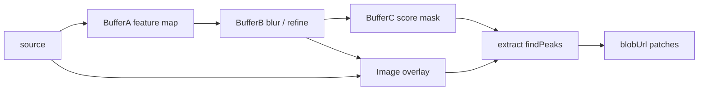

# Shader

`sonic-shader` — renderer WebGL2 **compatible ShaderToy** (pass `Image` + buffers `A–D` + `Common`).

For WGSL / WebGPU (1 pass, same DP glue): [`sonic-webgpu`](#core/components/functional/webgpu/webgpu.md/webgpu).

Import opt-in (hors bundle `functional`) :

<sonic-code language="javascript">
  <template>
import "@supersoniks/creative-stack/shader";
import type {
  SonicShaderConfig,
  SonicShaderOutput,
  ShaderExtractOutput,
  ShaderRoi,
  ShaderMouseMode,
  ShaderHoverParam,
} from "@supersoniks/creative-stack/shader";
  </template>
</sonic-code>

CDN (after the core): `creative-stack-shader.bundle.js` — see [CDN addons](#docs/_getting-started/cdn-addons.md/cdn-addons).

Uniforms supportés : `iResolution`, `iTime`, `iTimeDelta`, `iFrame`, `iFrameRate`, `iMouse`, `iDate`, `iChannel0–3`, `iChannelResolution`, `iChannelTime`, `iSampleRate`, `uParam0–3`.

Textures `channel0–3` : images, vidéos (`.webm` / `.mp4` / …), **ou** éléments page via `#id` (``, `<video>`, `<canvas>`, `sonic-3d` / `sonic-webgpu` / `sonic-shader`).

## Multipass sur une photo

Buffer A simule une height-map d’ondes (ripple) ; Image réfracte la photo via le gradient — **sans teinte**. Glisser la souris pour faire des vagues.

<docs-lit-demo for="docs-shader-multipass-demo"></docs-lit-demo>

Photo + depth parallax (HF): [Visual stack](#docs/_misc/visual-stack.md/visual-stack).

Live 3D → shader (no JPEG): [Visual stack](#docs/_misc/visual-stack.md/visual-stack).

## Chaînage d’effets (officiel)

**Règle :** brancher des passes dans **un** `sonic-shader` (buffers `A–D` → `Image`), pas deux composants via dataProvider — **sauf** pont live `#élément` (copie canvas chaque frame).

| Besoin | Mécanisme |
|--------|-----------|
| Sortie d’un effet → entrée du suivant | `image-ch0="buffer-a"` (ou `buffer-b`… / `self`) — **même contexte GPU**, FBO ping-pong |
| Scene 3D / autre canvas → post | `channel0="#plateau"` — copie `texImage2D` chaque `frameSeq` |
| Params / sync UI | `dataProvider` → `uParam0…3` **et** canaux (`channel0`, `bufferACh0`…) — string URL, `#id`, ou `SonicMediaRef` (`url` / `element`). Changer un canal ne recompile pas (rebind). |
| Hors viewport | `release-offscreen` : `auto` (défaut) libère sauf si une passe lit `self` ; `true` / `false` forcent |

Les passes intermédiaires sont **déjà offscreen** (FBO). Pas besoin d’un second `sonic-shader` invisible pour du multipass interne.

Deux instances séparées ne partagent pas leurs textures WebGL (contextes distincts). Le pont live `#id` **copie** le canvas source ; `frame-out` JPEG reste pour export / freeze.
Démo pédagogique : Buffer&nbsp;A = Sobel → Image = overlay + `param0`.

<docs-lit-demo for="docs-shader-chain-demo"></docs-lit-demo>

Exemple de câblage :

<sonic-code language="html">
  <template>
&lt;sonic-shader
  play
  buffer-a-ch0="/photo.jpg"
  image-ch0="buffer-a"
  image-ch1="/photo.jpg"
&gt;&lt;/sonic-shader&gt;
&lt;!-- .bufferA = effet A ; .image = effet B qui lit iChannel0 = buffer A --&gt;
  </template>
</sonic-code>

## Rollover / roll-out (`hover-param`)

Au survol, le composant anime un `uParamN` de `0` → `1` (et l’inverse au leave), avec easing `hover-speed`. Le shader lit ce param pour mixer l’effet on/off (zoom, aberration, ripple…). `play-on-hover` n’anime que pendant le hover / la transition.

Type : `ShaderHoverParam` = `0` | `1` | `2` | `3` | `"param0"`…`"param3"` | `""`.

<docs-lit-demo for="docs-shader-hover-demo"></docs-lit-demo>

## Sortie / sampling (`sample` + dataProvider)

`dataProvider` est **bidirectionnel** : `param0…` en entrée ; en sortie `mouseX` / `mouseY` / `hovering` / `frame` (+ `param0…` si `out-data-provider` est séparé, ou le slot `hover-param` seul si le DP est partagé avec le formulaire). Avec `sample`, lit la couleur sous le curseur → `sampleR/G/B/A` + `sampleLuma` (`SonicShaderOutput`). Event `out` (payload complet, y compris les params). Optionnel : `out-data-provider` pour séparer l’écriture.

**Publication paresseuse** : rien n’est écrit (ni `readPixels`) tant qu’aucun champ méta/sample n’a de lecteur DP (`@handle(frame)` / `@subscribe` / `sonic-value`…) et qu’aucun listener `out` n’est branché. Un `sonic-audio-input name="param0"` ne compte **pas** comme consommateur out (évite le write-back qui remettait les champs à 0). Dès qu’un vrai consommateur apparaît, les maj partent au rythme de `out-interval`. Avec `sample`, le `readPixels` suit le même gate.

Pattern typique — écoute `frame` + lecture massive :

<sonic-code language="typescript">
  <template>
@handle(shaderOutKey.frame)
onFrame() {
  const snap = get(shaderOutKey); // mouseX/Y, sampleR/G/B, luma…
}
  </template>
</sonic-code>

<docs-lit-demo for="docs-shader-out-demo"></docs-lit-demo>

## Extraction patches / singularities (`extract`)

A GPU pass writes a **score mask** (R channel) into a buffer; `extract` scans it, crops **patches** around peaks, and publishes scalars + `blobUrl` for downstream use.



| Input | Role |
|-------|------|
| `rois` (DP) | Optional manual ROIs `{ x, y, w?, h?, patch? }` |
| `extract-mask` | Score buffer (R channel) — e.g. `buffer-c` |
| `extract-source` | Color pass to crop (`image` by default) |

`detect` scores: mask R channel (prefer a soft map, not hard-clipped), then **renormalized** to the best peak in the batch (`1` = strongest). `findPeaks` sorts and keeps the top ones (NMS ≈ `min(patch/3, 16)` px).

| Output | Role |
|--------|------|
| `extracts` / `extractCount` / `extractSeq` | Items + count + sequence |
| Event `extract` | `ShaderExtractOutput` |
| `readRegion` / `extractNow()` | On-demand API |

**Lazy**: no `readPixels` without a DP reader / `extract` event listener.

<sonic-code language="typescript">
  <template>
@handle(extractKey.extractSeq)
onExtract() {
  const extracts = get(extractKey.extracts) ?? [];
}
  </template>
</sonic-code>

Live Harris → patches → WebGPU: [Visual stack](#docs/_misc/visual-stack.md/visual-stack).

## Précision des buffers (`buffer-format`)

Par défaut, les buffers A–D sont en **RGBA8** (unsigned). Un tenseur Harris naïf (`Ix*Ix`, `Iy*Iy`, `Ix*Iy`) **perd le signe** de `IxIy` et sature les carrés → bords au lieu de coins.

| Valeur | Usage |
|--------|--------|
| `rgba8` (défaut) | Couleur / masques 0–1 |
| `rgba16f` | Calculs signés (Harris, gradients) — recommandé |
| `rgba32f` | Haute précision ; filtrage `NEAREST` si `OES_texture_float_linear` manque |

Repli auto en `rgba8` si `EXT_color_buffer_float` est absent (`console.warn` une fois). L’attribut reflété `active-buffer-format` indique le format réellement utilisé. La passe Image reste le canvas RGBA8.

```html
<sonic-shader buffer-format="rgba16f" buffer-a="…" …></sonic-shader>
```

## API typée (`SonicShaderConfig`)

| Champ / attribut | Type | Rôle |
|------------------|------|------|
| `image` | `string` | GLSL pass Image (**requis**, propriété JS) |
| `bufferA`…`bufferD` / `buffer-a`… | `string` | Passes multipass |
| `common` | `string` | GLSL partagé |
| `bufferFormat` / `buffer-format` | `rgba8` \| `rgba16f` \| `rgba32f` | Format buffers A–D (défaut `rgba8`) ; `active-buffer-format` reflète le format réellement utilisé |
| `channel0`…`channel3` | `string` | URLs, `#id` élément, ou refs buffers (toutes passes) |
| `imageCh0`… / `image-ch0`… | `string` | Override canal : URL, `#id`, `self`, `buffer-a`…, `none` |
| `play` | `boolean` | Boucle RAF (défaut `true`) |
| `playOnHover` / `play-on-hover` | `boolean` | Anime seulement au hover / transition |
| `mouse` | `boolean` | Pointeur → `iMouse` (défaut `true`) |
| `mouseMode` / `mouse-mode` | `ShaderMouseMode` | `direct` \| `target` |
| `mouseSpeed` / `mouse-speed` | `number` | Poursuite target (1/s, défaut `8`) |
| `hoverParam` / `hover-param` | `ShaderHoverParam` | Slot `uParamN` on/off rollover |
| `hoverSpeed` / `hover-speed` | `number` | Easing hover (1/s, défaut `10`) |
| `param0`…`param3` | `number` | → `uParam0`…`uParam3` |
| `dataProvider` | `string` | Publisher entrée (`param0`…) + sortie par défaut |
| `outDataProvider` / `out-data-provider` | `string` | Publisher de sortie (défaut = `dataProvider`) |
| `sample` | `boolean` | Lit la couleur sous le pointeur → `sampleR…` / `sampleLuma` |
| `outInterval` / `out-interval` | `number` | Intervalle publication + event `out` (ms, défaut `80`) |
| `extract` | `boolean` | Active extraction patches / singularités |
| `extractInterval` / `extract-interval` | `number` | Throttle extract ms (défaut = out-interval) |
| `extractSource` / `extract-source` | `string` | Pass couleur : `image` \| `buffer-a`… |
| `extractMask` / `extract-mask` | `string` | Pass mask : `none` \| `buffer-a`… |
| `extractThreshold` / `extract-threshold` | `number` | Seuil peaks 0–1 (défaut `0.5`) |
| `extractMax` / `extract-max` | `number` | Cap détection (défaut `8`) |
| `extractPatch` / `extract-patch` | `number` | Patch px par défaut (défaut `16`, max 128) |
| `extractBitmaps` / `extract-bitmaps` | `boolean` | Génère `blobUrl` par item |
| `extractDataProvider` / `extract-data-provider` | `string` | Publisher extract (défaut = out) |
| `aspectRatio` / `aspect-ratio` | `string` | Ratio CSS forcé |
| `dprMax` / `dpr-max` | `number` | Plafond DPR (défaut `2`) |
| `releaseOffscreen` / `release-offscreen` | `boolean` \| `"auto"` | Hors viewport : libère textures/FBO (garde le contexte). `auto` (défaut) : ne libère pas si une passe lit `self`. `dispose` + loseContext au disconnect |

## État et visibilité

Un shader qui garde un état via `self` (feedback frame précédente) n’est plus réinitialisé quand il sort de l’écran : avec `release-offscreen="auto"` (défaut), seuls le RAF et les vidéos sont mis en pause ; les FBO restent. Forcer `release-offscreen` (attribut booléen / `true`) restaure l’ancien comportement (libération hors viewport même avec `self`).

Changer `channel0…3` / `*-ch*` re-lie les textures **sans** recompiler ni vider les buffers.

## Markup

<sonic-code language="html">
  <template>
&lt;sonic-shader
  mouse
  mouse-mode="target"
  mouse-speed="6"
  hover-param="0"
  hover-speed="12"
  play
  play-on-hover
  release-offscreen="auto"
  channel0="/docs/shader-samples/color.jpg"
&gt;&lt;/sonic-shader&gt;
  </template>
</sonic-code>

Assigne le GLSL via `.image` (et `.bufferA`, …) depuis JS / Lit.

## Events

`error` — compile / link / WebGL (`detail.message`, `detail.pass`, `detail.infoLog`).

`out` — snapshot `SonicShaderOutput` (throttlé par `out-interval`, **seulement s’il y a un listener**) : souris, params, samples.

`extract` — snapshot `ShaderExtractOutput` (throttlé, paresseux) : patches manuels + détectés.

## Notes

- WebGL2 requis. Hors viewport (`release-offscreen`) : textures/FBO libérés, contexte conservé (évite loseContext sur le même canvas). Slot navigateur (~8–16) libéré au disconnect.
- **Chaînage d’effets** : multipass dans un seul composant (`buffer-a`… → `image-chN`). Pas de bus texture entre deux `sonic-shader` via dataProvider.
- Vidéos : lecture auto muted + loop.
- Hors scope : Sound, Cubemap, VR ; chaînage multi-instances / contexte GPU partagé.
- Pas d’import dans le bundle `functional` core.
